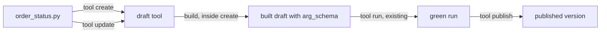

# Plan: create a code tool from a Python file

## What it does

Today `voiceai` can list, read, build and run a tool, but not create one. The
only way to create a tool is a side effect of `voiceai agents push` with a
tool body in the package. This plan adds three small commands, so an author
can go from a local `.py` file to a published tool:

```sh
voiceai tool create order_status.py --description "Look up an order." --secret ORDERS_API_KEY
voiceai tool run order_status --input sample.json --confirm-side-effects
voiceai tool publish order_status
```

After that, an unmute package uses the tool with `slng: order_status`, and
nothing in unmute changes.

## How it works



1. `tool create <file.py>` reads the file, posts it as a new `code` tool, then
   builds it. Build is the existing introspect call. It reads the `Input` model
   and stores the argument schema. The command prints that schema and the next
   command to run.
2. `tool update <tool> --file <file.py>` changes the code of a tool that
   exists, then builds it again. A code change marks the draft stale and locks
   the green run, so a rebuild is always needed.
3. `tool run` already exists. A successful run is the "green run" that
   publishing needs. It executes the code for real, so it keeps its
   `--confirm-side-effects` consent flag.
4. `tool publish <tool>` asks the platform to publish. It prints the new
   version number, or every failed gate with its reason.

The order is the platform's, not ours: publish refuses until a build and a
green run match the current code. Each command does one step and says what
comes next. So no new flag is needed to stop halfway, and a failed run does
not leave a half-published tool.

## The Python file

The platform finds three names in the module. It does not import any `slng`
module.

```python
from pydantic import BaseModel, Field


class Input(BaseModel):
    order_id: str = Field(description="The order number the caller reads out.")


class Output(BaseModel):
    status: str
    delivers_on: str | None = None


def handler(input: Input) -> Output:
    return Output(status="shipped", delivers_on="2026-10-08")
```

- `Input` and `Output` are pydantic `BaseModel` subclasses. `handler` takes
  one `Input`.
- The `Input` schema becomes the tool's arguments. Field descriptions are what
  the model reads.
- A declared secret arrives as an environment variable. Its value is removed
  from the run output.
- The code has no internet access. A tool that calls a service is an
  `api_request` tool instead, and that stays a dashboard job for now.
- Dependencies are exact pins only, such as `orjson==3.11.4`.

Source: `slng_backend` `app/services/tool_runner.py` (`_SCRIPT`) and
`STARTER_CODE_SRC` in `app/services/tools.py`.

## The commands

| Command | Flags | HTTP calls |
|---|---|---|
| `tool create <file.py>` | `--name` (default: file name without `.py`), `--description`, `--secret NAME` (repeat), `--dependency pkg==x` (repeat), `--json` | `POST /v1/agents/tools`, then `POST /v1/agents/tools/{id}/introspect` |
| `tool update <tool> --file <file.py>` | the same flags, all optional, plus `--id` | `PATCH /v1/agents/tools/{id}`, then introspect |
| `tool publish <tool>` | `--id`, `--json` | `POST /v1/agents/tools/{id}/publish` |

The create body is the existing `PackageToolBody` shape:

```json
{
  "name": "order_status",
  "tool_type": "code",
  "description": "Look up an order.",
  "code_src": "<the file>",
  "config": {"type": "code", "import_probes": [], "egress": {}},
  "declared_secrets": ["ORDERS_API_KEY"],
  "dependencies": []
}
```

`tool update` sends only the fields given, and never `tool_type`, which cannot
change. This matches what push already does.

## Checks before any request

Each one is cheap, and each one stops a request the platform would refuse or
get wrong:

- The file is empty or blank: refuse. The backend replaces an empty
  `code_src` with its weather starter example, so an empty file would create
  a working tool nobody wrote.
- The name does not match `^[A-Za-z0-9_-]+$`, or is over 200 characters:
  refuse with the rule.
- A `--dependency` that is not one `name==version` pin: refuse.
- `tool create` with a name the organisation already has: refuse, and name
  `tool update`. The backend answers 409 anyway; the CLI says what to do.
- A `--secret` that is missing from the vault, or is a variable and not a
  secret: warn on create, because publish will refuse it. Reuse
  `listSecrets` from `secret.ts`, the same check push makes.

Do not parse the Python locally. Build reports a missing `Input`, `Output` or
`handler`, with the real Python error, and a regex here would only disagree
with it.

## Reuse, do not copy

`push.ts` `syncTool` already makes these exact calls for a shipped tool body.
Move the four calls into one small module, `cli/src/lib/tool-write.ts`:

- `writeTool(body, existingId?)`: POST or PATCH
- `buildTool(id)`: introspect
- `runTool(id, input)`: run with consent
- `publishTool(id)`: publish, with the 409 handled as a result and not an
  error

Then `syncTool` calls them, and so do the new commands. `describeGates`,
`toolWriteBody` and `needsGreenRun` are already exported. `tool build` and
`tool run` can switch to `buildTool` and `runTool` in the same change.

## Output

- Human output, `tool create`: the tool id, the argument names and types from
  the build, then the next command, with the sample path filled in.
- Human output, `tool publish`: `published order_status version 3`, or one line
  per failed gate, exit 1.
- `--json`: the platform's own `ToolDetail` for create and update, and
  `PublishResult` for publish, as `tool get` already does. Exit 1 on any
  refusal, with `{ok: false, error}` through the existing `fail()`.

## Tests

In `cli/src/commands/tool.test.ts`, with the stub server it already uses:

1. create sends the body above, then introspects, and prints the schema
2. an empty file is refused with no request made
3. a bad name and a bad pin are refused with no request made
4. create on an existing name is refused and names `tool update`
5. update sends PATCH without `tool_type`, then introspects
6. publish 409 prints every failed gate and exits 1
7. publish success prints the version
8. `--json` shapes for all three

`push.test.ts` must keep passing unchanged after the `tool-write.ts` move.
That is the check that the refactor kept behaviour.

## Docs

- the `tool` help text in `tool.ts` (COMMANDS, EXAMPLES, NOTES)
- `cli/README.md`, the tool section
- the root `README.md` table, which says tools are read-only and written by
  `agents push`

## Not in this plan

- Creating `api_request` tools. Their config is a URL template, auth and
  headers, which needs its own flags. Add it when somebody asks.
- `tool create` running and publishing in one go. Three commands keep the
  consent step visible, and a script can chain them.
- unmute compiling a `local:` tool into a hosted code tool. That is the
  natural next step for unmute, and it would call these same three commands.
